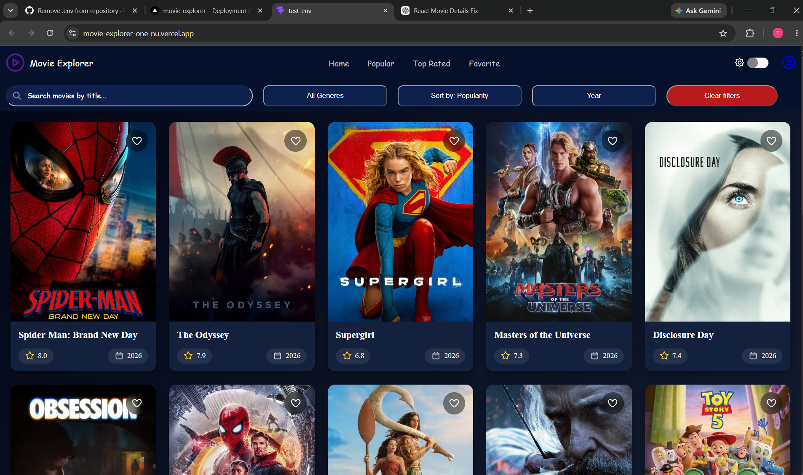
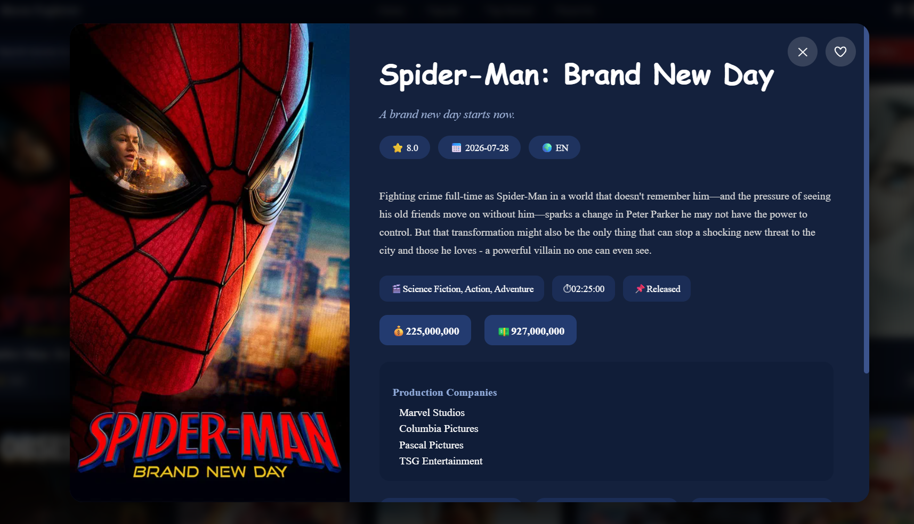

# 🎬 Movie Explorer

A responsive React application powered by the TMDB API that lets users discover movies, search by title, filter by genre/year/popularity, view detailed movie information, and save favorite movies.

---

## 🌐 Live Demo

🔗 https://movie-explorer-one-nu.vercel.app/

---

## 📸 Screenshots

<p align="center">
  
  
</p>

---

## ✨ Features

- 🔍 Search movies by title
- 🎭 Filter by genre
- 📅 Filter by release year
- 📊 Sort by:
  - Popular
  - Top Rated
  - Now Playing
  - Upcoming
  - Trending Today
  - Trending This Week
- ❤️ Add/Remove favorite movies
- 🌙 Dark / Light Mode
- 📱 Fully Responsive Design
- 🎬 Detailed movie information popup
- ⏳ Loading spinner while fetching data

---

## 🛠️ Tech Stack

### Frontend
- React
- Vite
- JavaScript (ES6+)
- CSS3

### API
- TMDB (The Movie Database) API

### Libraries
- Font Awesome

### Deployment
- Vercel

---

## 📂 Project Structure

```
src/
│── App.jsx
│── Header.jsx
│── Navbar.jsx
│── Moviecards.jsx
│── Moviedetails.jsx
│── App.css
```

---

## 🚀 Getting Started

Clone the repository

```bash
git clone https://github.com/Hari-769/Movie-Explorer.git
```

Go into the project

```bash
cd Movie-Explorer
```

Install dependencies

```bash
npm install
```

Create a `.env` file

```env
VITE_API_KEY=YOUR_TMDB_API_KEY
```

Run the project

```bash
npm run dev
```

---

## 🔑 Environment Variables

The application requires a TMDB API key.

```
VITE_API_KEY=YOUR_API_KEY
```

---

## 💻 GitHub Repository

https://github.com/Hari-769/Movie-Explorer

---

## 👨‍💻 Author

**Hari K**

GitHub: https://github.com/Hari-769

---

## ⭐ Future Improvements

- Cast & Crew section
- Similar movie recommendations
- Infinite scrolling / Pagination
- Debounced search
- Better animations
